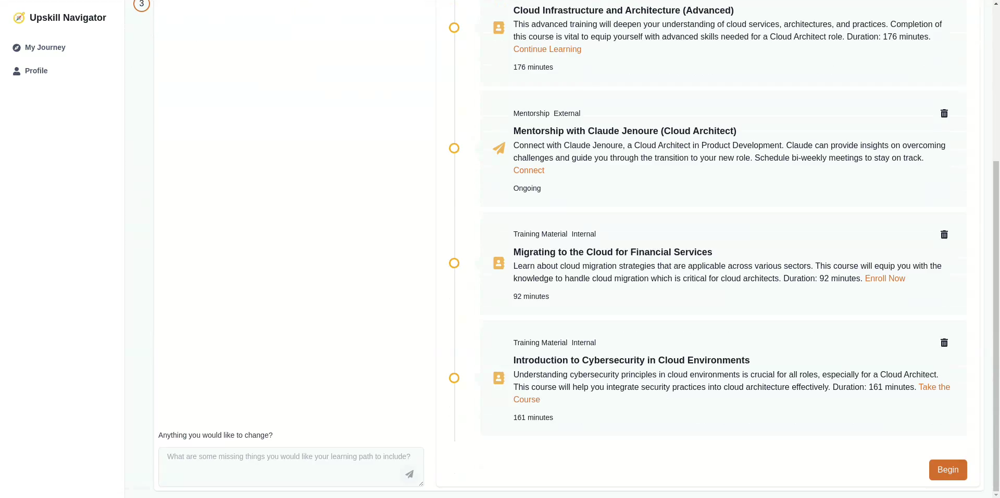

# Upskill Navigator 🧭


**Are you looking to empower your employees and unlock their full potential? Introducing Upskill Navigator—an AI-powered tool designed to help your workforce grow within your organization.**

With Upskill Navigator, employees can define their career objectives—whether they want to switch roles, take on more responsibility, or explore new departments. Based on their goals, our platform suggests tailored career and upskilling paths, utilizing your company’s internal resources like job boards, courses, announcements, and mentorship programs, as well as external learning opportunities.

Each personalized learning path includes actionable steps, like completing relevant courses, connecting with mentors, or participating in networking events. By providing your team with a roadmap for growth, Upskill Navigator not only drives personal development but also strengthens your organization’s talent pool—making it a win-win.

**Upskill Navigator helps you leverage your existing talent, fostering innovation and retention while supporting diversity, equity, and inclusion initiatives. Give your employees the tools they need to thrive, and your organization the competitive edge it deserves.**

## Demo

<div align="center">
  <a href="https://youtu.be/VdpJVsUkzGI"></a>
</div>

## Features 🔧

 - **AI-Powered Career Path Recommendations**
Upskill Navigator uses AI to analyze employee profiles, career objectives, and organizational data to suggest tailored career paths. Whether employees want to switch roles, move to a different department, or take on new responsibilities, the AI helps them explore the best options.

- **Personalized Learning Paths**
Once a career path is chosen, the tool generates a custom learning plan, combining internal corporate resources (courses, training, job boards) and external learning platforms. Each learning path is uniquely designed based on the employee's goals and current skill set.

- **Mentorship Matching**
The platform recommends mentors within the organization who are aligned with the employee’s aspirations. By analyzing employee profiles, experience, and goals, Upskill Navigator creates valuable mentorship opportunities for career growth and development.

 - **Networking and Event Suggestions**
Through internal communication channels, the tool identifies relevant events like networking sessions, workshops, or company gatherings that align with the employee’s career interests, encouraging participation in key organizational activities.


 - **Integration with Internal Systems**
Upskill Navigator offers the ability to connect with internal resources such as job boards, employee lists, announcement pages, and course catalogs, ensuring that all recommendations and learning paths are relevant and up to date.

 - **Actionable Progress Tracking**
Employees can track their progress toward career goals, course completions, mentorship interactions, and event participation—all in one place. The tool provides insights on milestones and remaining steps to achieve their objectives.

## Configuration 

To configure Upskill Navigator for your organization, follow these steps to set up the org.config.js file, environment variables, and webhook integrations for internal resources.

### 1. Create the Configuration File

In the root of your project, locate or create the org.config.js file. This file contains all the necessary configuration options specific to your organization, including departments, roles, internal resources, and SSO integration.

Here’s an example of how to structure your org.config.js file:

```javascript

module.exports = {
  organization: {
    name: "Your Organization Name",
    departments: [
      "Department 1",
      "Department 2",
      // Add more departments here
    ],
    roles: [
      "Role 1",
      "Role 2",
      // Add more roles here
    ],
    dei_groups: [
      "Group 1",
      "Group 2",
      // Add DEI (Diversity, Equity, Inclusion) groups here
    ],
  },
  
  internalResources: {
    // Define webhook functions for internal job boards, courses, announcements, etc.
    jobBoard: {
      fetchJobs: {
        function: async () => {
          const response = await fetch(process.env.JOB_BOARD_API_URL, {
            method: "GET",
            headers: { Authorization: `Bearer ${process.env.API_TOKEN}` },
          });
          return await response.json();
        },
        description: "Fetch job listings from the internal job board.",
        parameters: {
          type: "object",
          properties: {
            department: {
              type: "string",
              description: "Department to filter job listings (optional).",
            },
          },
        },
        returns: {
          type: "array",
          items: {
            type: "object",
            properties: {
              id: { type: "string", description: "Job ID" },
              title: { type: "string", description: "Job title" },
            },
          },
        },
      },
    },
    // Add more internal resources like courses, announcements, etc.
  },

  sso: {
    provider: "Okta", // Replace with your auth provider (e.g., Okta, Auth0, or custom)
    ssoUrl: process.env.SSO_URL,
    clientId: process.env.SSO_CLIENT_ID,
    clientSecret: process.env.SSO_CLIENT_SECRET,
    redirectUri: process.env.SSO_REDIRECT_URI,
  },

  security: {
    encryptionKey: process.env.ENCRYPTION_KEY,
    sessionTimeout: 3600, // Session timeout in seconds
  },
};
```

### 2. Set Up Environment Variables

For security and flexibility, Upskill Navigator uses environment variables to store sensitive data like API tokens, URLs, and credentials. You can define these variables in a .env file or directly in your hosting platform (e.g., AWS, Heroku).

Add the following environment variables to your system:

```makefile

# API URLs and Tokens
JOB_BOARD_API_URL=https://api.yourcompany.com/jobs
COURSES_API_URL=https://api.yourcompany.com/courses
ANNOUNCEMENTS_API_URL=https://api.yourcompany.com/announcements
MENTORSHIP_API_URL=https://api.yourcompany.com/mentorship
API_TOKEN=your-api-token-here

# SSO Configuration
SSO_URL=https://sso.yourcompany.com
SSO_CLIENT_ID=your-client-id-here
SSO_CLIENT_SECRET=your-client-secret-here
SSO_REDIRECT_URI=https://yourapp.com/auth/callback

# Security Settings
ENCRYPTION_KEY=your-encryption-key-here
Note: Always store sensitive information such as API tokens, client secrets, and encryption keys in environment variables and never hard-code them into the application.
```

### 3. Webhook Integration for Internal Resources

To integrate internal resources like job boards, training courses, announcements, and mentorship opportunities, you need to define webhook functions in the internalResources section of the org.config.js file.

Each webhook function should include:

Description: A brief explanation of what the function does.

Parameters: The inputs the function accepts, defined in a JSON-schema format.

Returns: The expected output, detailing the structure of the returned data.
Here’s an example configuration for internal resource integration:

```javascript

internalResources: {
  // Job Board Integration
  jobBoard: {
    fetchJobs: {
      function: async (parameters) => {
        const response = await fetch(`${process.env.JOB_BOARD_API_URL}?department=${parameters.department}`, {
          method: "GET",
          headers: { Authorization: `Bearer ${process.env.API_TOKEN}` },
        });
        return await response.json();
      },
      description: "Fetch job listings from the internal job board.",
      parameters: {
        type: "object",
        properties: {
          department: {
            type: "string",
            description: "Department to filter job listings by (optional).",
          },
        },
        required: [],
      },
      returns: {
        type: "array",
        items: {
          type: "object",
          properties: {
            id: { type: "string", description: "Job ID" },
            title: { type: "string", description: "Job title" },
            department: { type: "string", description: "Job department" },
          },
        },
      },
    },
  },
  
  // Training Courses Integration
  courses: {
    fetchCourses: {
      function: async (parameters) => {
        const response = await fetch(`${process.env.COURSES_API_URL}?category=${parameters.category}`, {
          method: "GET",
          headers: { Authorization: `Bearer ${process.env.API_TOKEN}` },
        });
        return await response.json();
      },
      description: "Fetch training courses from the internal training platform.",
      parameters: {
        type: "object",
        properties: {
          category: {
            type: "string",
            description: "Course category to filter by (optional).",
          },
        },
        required: [],
      },
      returns: {
        type: "array",
        items: {
          type: "object",
          properties: {
            id: { type: "string", description: "Course ID" },
            title: { type: "string", description: "Course title" },
            category: { type: "string", description: "Course category" },
            duration: { type: "number", description: "Course duration (in hours)" },
          },
        },
      },
    },
  },
  
  // Announcements Integration
  announcements: {
    fetchAnnouncements: {
      function: async (parameters) => {
        const response = await fetch(`${process.env.ANNOUNCEMENTS_API_URL}?since=${parameters.since}`, {
          method: "GET",
          headers: { Authorization: `Bearer ${process.env.API_TOKEN}` },
        });
        return await response.json();
      },
      description: "Fetch announcements from the internal communication system.",
      parameters: {
        type: "object",
        properties: {
          since: {
            type: "string",
            format: "date-time",
            description: "Fetch announcements since this date (optional).",
          },
        },
        required: [],
      },
      returns: {
        type: "array",
        items: {
          type: "object",
          properties: {
            id: { type: "string", description: "Announcement ID" },
            title: { type: "string", description: "Announcement title" },
            content: { type: "string", description: "Announcement content" },
            date: { type: "string", format: "date-time", description: "Date of announcement" },
          },
        },
      },
    },
  },

  // Mentorship Program Integration
  mentorship: {
    fetchMentorshipMatches: {
      function: async (parameters) => {
        const response = await fetch(`${process.env.MENTORSHIP_API_URL}?department=${parameters.department}`, {
          method: "GET",
          headers: { Authorization: `Bearer ${process.env.API_TOKEN}` },
        });
        return await response.json();
      },
      description: "Fetch potential mentorship matches from the organization.",
      parameters: {
        type: "object",
        properties: {
          department: {
            type: "string",
            description: "Department to filter mentors by (optional).",
          },
        },
        required: [],
      },
      returns: {
        type: "array",
        items: {
          type: "object",
          properties: {
            id: { type: "string", description: "Mentor ID" },
            name: { type: "string", description: "Mentor name" },
            department: { type: "string", description: "Mentor's department" },
            experience: { type: "string", description: "Years of experience" },
          },
        },
      },
    },
  },
}

```
### 4. SSO Integration

To enable Single Sign-On (SSO) for employee authentication, configure the sso section in the org.config.js file:

```javascript

sso: {
  provider: "Your SSO Provider Name",
  ssoUrl: process.env.SSO_URL,
  clientId: process.env.SSO_CLIENT_ID,
  clientSecret: process.env.SSO_CLIENT_SECRET,
  redirectUri: process.env.SSO_REDIRECT_URI,
}
```

Make sure the corresponding environment variables for your SSO provider are set up correctly.


## Development

First, run the development server:

```bash
npm run dev
# or
yarn dev
# or
pnpm dev
# or
bun dev
```

Open [http://localhost:3000](http://localhost:3000) with your browser to see the result.

You can start editing the page by modifying `app/page.tsx`. The page auto-updates as you edit the file.

This project uses [`next/font`](https://nextjs.org/docs/app/building-your-application/optimizing/fonts) to automatically optimize and load [Geist](https://vercel.com/font), a new font family for Vercel.

### Learn More

To learn more about Next.js, take a look at the following resources:

- [Next.js Documentation](https://nextjs.org/docs) - learn about Next.js features and API.
- [Learn Next.js](https://nextjs.org/learn) - an interactive Next.js tutorial.

You can check out [the Next.js GitHub repository](https://github.com/vercel/next.js) - your feedback and contributions are welcome!